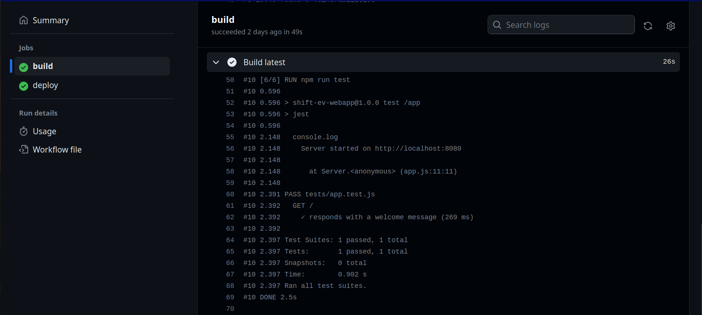

# shiftEV-task
Deploy a web appliciation with a CI/CD pipeline.

## Project Overview
This project is aimed at deploying a dockerized web application on Digital Ocean using CI/CD GitHub Actions Pipeline. It involves using docker platform to package the web application and its dependencies into a Docker image. Then deploy and manage the web application in a secure and scalable manner.

## Continuous Integration CI
### Tool Used 
1- GitHub Actions
2- DigitalOcean Container Registry

create a CI configuration file in the GitHub repository. This file defines the CI workflow.

- CI process will begin when it trigger a push in the main branch.
- It will automatically login my to digital ocean account to build / push images
```
docker build -t registry.digitalocean.com/mmelegy/shiftev-app .
```
```
docker push registry.digitalocean.com/mmelegy/shiftev-app
```
### For The Unit Test
- I used jest which is testing framework designed to ensure correctness of any code
- I used it into the dockerfile to run while building process to check errors before push image


## Dockerization
1- Created a Dockerfile to Dockerize My Web App.

2- Build the Docker Image.

3- Run the Docker Container and map a port from your host machine to the container.

4- Test the Container by access web application in a web browser.

5- Push to a Container Registry (digitalocean container registry).

## Continuous Deployment CD
1- Install doctl to allows interact with the DigitalOcean API via the command line

2- In the deployment file just Passing the APP Name & Secrets to connect to the APP and the image name with the latest version tag.

3- After a successfully deploy statge just go to the APP and hit the secured URL link to open the web application.

### The application is successfully deployed!🚀 
```
https://shiftev-app-lcqo7.ondigitalocean.app/
```


## How to Run Locally!
### prerequisites
* Nodejs installed on local system
* docker installed on local system

- clone this repo
```
git clone https://github.com/mahmoud-24/shiftEV-task.git
```

- Navigate to the Project Directory
```
cd <repo-name>
```

- Build the Docker Image
```
docker build -t <your-image-name> .
```

- Run the Docker Container
```
docker run -p 8080:8080 <your-image-name>
```

- Access the Web Application 

